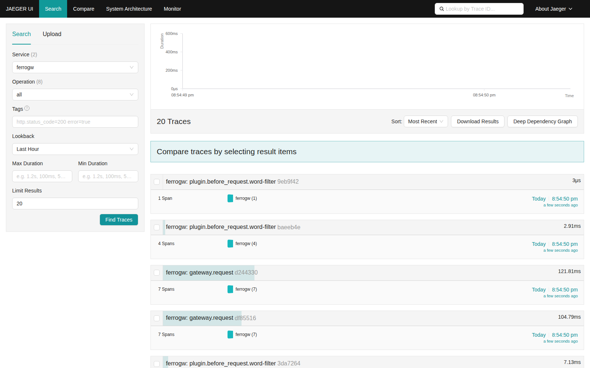

<div align="center">

<p align="right">
  <a href="README.md">English</a> | <a href="README.zh-CN.md">中文</a>
</p>

<table border="0" cellspacing="0" cellpadding="0"><tr>
  <td rowspan="2"></td>
  <td align="center"><h1>Ferro Labs AI Gateway</h1></td>
</tr><tr>
  <td align="center"><strong>Open-Source, OpenAI-Compatible LLM Gateway</strong></td>
</tr></table>

**High-performance AI gateway in Go. Route LLM requests across 30 providers via a single OpenAI-compatible API.**

**Deploy templates**

[](https://railway.com/deploy/ferro-labs-ai-sqlite-storage?referralCode=KblxKX&utm_medium=integration&utm_source=template&utm_campaign=generic)
[](https://railway.com/deploy/ferro-labs-ai-postgresql-storage?referralCode=KblxKX&utm_medium=integration&utm_source=template&utm_campaign=generic)
[](https://render.com/deploy?repo=https://github.com/ferro-labs/ai-gateway)

[](https://go.dev)
[](https://pkg.go.dev/github.com/ferro-labs/ai-gateway)
[](https://codecov.io/gh/ferro-labs/ai-gateway)
[](LICENSE)
[](https://github.com/ferro-labs/ai-gateway/stargazers)
[](https://github.com/ferro-labs/ai-gateway/actions/workflows/ci.yml)
[](https://github.com/ferro-labs/ai-gateway/actions/workflows/code-scanning.yml)
[](https://deepwiki.com/ferro-labs/ai-gateway)
[](https://artifacthub.io/packages/search?org=ferro-labs)
[](https://docs.ferrolabs.ai)
[](https://discord.gg/yCAeYvJeDV)

📖 **Documentation:** [docs.ferrolabs.ai](https://docs.ferrolabs.ai)

🔀 **30 providers, 2,500+ models — one API**<br/>
⚡ **13,925 RPS at 1,000 concurrent users** ([v1.0.0 benchmark](#performance))<br/>
📦 **Single static binary, no external services required, 32 MB base memory**


</div>

---

## Quick Start

Get from zero to first request in under 2 minutes.

### Option A — Binary (fastest)

```bash
VER=$(curl -fsSL https://api.github.com/repos/ferro-labs/ai-gateway/releases/latest | grep '"tag_name"' | cut -d'"' -f4)
curl -fsSL "https://github.com/ferro-labs/ai-gateway/releases/download/${VER}/ferrogw_${VER#v}_linux_amd64.tar.gz" | tar xz
chmod +x ferrogw
./ferrogw init                        # generates config.yaml + MASTER_KEY
export GATEWAY_CONFIG=./config.yaml   # the server reads a config file only when this is set
export OPENAI_API_KEY=sk-your-key     # providers are registered at startup, so export before starting
export MASTER_KEY=fgw_your-master-key # the key ferrogw init printed
./ferrogw                             # starts the server
```

### Option B — Docker

```bash
docker pull ghcr.io/ferro-labs/ai-gateway:latest
docker run -p 8080:8080 \
  -e OPENAI_API_KEY=sk-your-key \
  -e MASTER_KEY=fgw_your-master-key \
  ghcr.io/ferro-labs/ai-gateway:latest
```

### Option C — Go

```bash
go install github.com/ferro-labs/ai-gateway/cmd/ferrogw@latest
ferrogw init                          # first-run setup
export GATEWAY_CONFIG=./config.yaml   # the server reads a config file only when this is set
export OPENAI_API_KEY=sk-your-key     # providers are registered at startup, so export before starting
export MASTER_KEY=fgw_your-master-key # the key ferrogw init printed
ferrogw                               # start the server
```

### Verifying releases

Every release publishes a SHA-256 checksum file, a keyless [cosign](https://github.com/sigstore/cosign)
signature over it, and an SPDX SBOM beside each archive. There are no long-lived signing keys:
the identity on the certificate is the release workflow itself.

```bash
VER=v1.3.2                                  # the release tag you downloaded
REPO=ferro-labs/ai-gateway
BASE="https://github.com/$REPO/releases/download/$VER"
IDENTITY="https://github.com/$REPO/.github/workflows/release.yml@refs/tags/$VER"

for f in checksums.txt checksums.txt.pem checksums.txt.sig; do curl -fsSLO "$BASE/$f"; done

# 1. Verify the signature over the checksum file.
cosign verify-blob checksums.txt \
  --certificate checksums.txt.pem \
  --signature checksums.txt.sig \
  --certificate-identity "$IDENTITY" \
  --certificate-oidc-issuer https://token.actions.githubusercontent.com

# 2. Verify what you downloaded against the now-trusted checksum file.
sha256sum --ignore-missing -c checksums.txt
```

`checksums.txt` lists every archive **and** every SBOM, so one signature covers both.
`--ignore-missing` checks only the files present in the current directory (on macOS,
`shasum -a 256 --ignore-missing -c checksums.txt`). Signature verification needs cosign v2 or newer.

**Container images.** Verify the version tag directly — it is a multi-platform manifest and it
is what carries the signature:

```bash
cosign verify ghcr.io/ferro-labs/ai-gateway:1.3.2 \
  --certificate-identity "https://github.com/ferro-labs/ai-gateway/.github/workflows/release.yml@refs/tags/v1.3.2" \
  --certificate-oidc-issuer https://token.actions.githubusercontent.com
```

Image tags carry no leading `v`; the certificate identity does, because it names the git tag.

Images also carry an SPDX SBOM as a build attestation, readable with
`cosign download attestation` or `docker buildx imagetools inspect`. That is separate from the
per-archive SBOM files below, which describe the archives rather than the image.

**SBOMs.** One SPDX-JSON document per archive, published next to it as
`<archive-name>.sbom.json` — for example `ferrogw_1.3.2_linux_amd64.tar.gz.sbom.json`.

### First-time setup

`ferrogw init` generates a master key and writes a minimal `config.yaml`:

```
$ ferrogw init

  Ferro Labs AI Gateway -- Setup

  [OK] Created config.yaml
  [OK] Master key: fgw_PASTE_THE_KEY_FERROGW_INIT_PRINTED

  [!] Save this key -- you need it for the Admin API and web application.
    export MASTER_KEY=fgw_PASTE_THE_KEY_FERROGW_INIT_PRINTED

  Next steps:
    1. Use this config:    export GATEWAY_CONFIG=config.yaml
    2. Set provider API keys (e.g. export OPENAI_API_KEY=sk-...)
    3. Start the gateway:  ferrogw serve
    4. Check readiness:    curl http://localhost:8080/readyz
```

The master key is shown once — store it in your `.env` file or secret manager. It is never written to disk.

<div align="center">
  
</div>

### Minimal config

Create `config.yaml` (or use `ferrogw init`), then point the gateway at it with `export GATEWAY_CONFIG=./config.yaml` — a config file is loaded only when that variable names it:

```yaml
strategy:
  mode: fallback

targets:
  - virtual_key: openai
    retry:
      attempts: 3
      on_status_codes: [429, 502, 503]
  - virtual_key: anthropic

aliases:
  fast: gpt-4o-mini
  smart: claude-3-5-sonnet-20241022
```

### First request

```bash
export MASTER_KEY=fgw_your-master-key   # the key ferrogw init printed, in whichever shell you curl from

curl http://localhost:8080/v1/chat/completions \
  -H "Content-Type: application/json" \
  -H "Authorization: Bearer $MASTER_KEY" \
  -d '{
    "model": "gpt-4o-mini",
    "messages": [{"role": "user", "content": "Hello from Ferro Labs AI Gateway"}]
  }' | jq
```

---

## Why Ferro Labs AI Gateway

Most AI gateways are Python proxies that crack under load or JavaScript services that eat memory. Ferro Labs AI Gateway is written in Go from the ground up for real-world throughput — a single binary that routes LLM requests with predictable latency and minimal resource usage.

| Feature          | Ferro Labs  | LiteLLM | Bifrost    | Kong AI     |
|:-----------------|:------------|:--------|:-----------|:------------|
| Language         | Go          | Python  | Go         | Go/Lua      |
| Single binary    | ✅          | ❌      | ✅         | ❌          |
| Providers        | 30          | 100+    | 20+        | 10+         |
| MCP support      | ✅          | ❌      | ✅         | ❌          |
| Response cache   | ✅          | ✅      | ✅         | ❌ (paid)   |
| Guardrails       | ✅          | ✅      | ❌         | ❌ (paid)   |
| OSS license      | Apache 2.0  | MIT     | Apache 2.0 | Apache 2.0  |
| Managed cloud    | Coming Soon | ✅      | ✅         | ✅          |

---

## Performance

Every figure in this section comes from one run: **Ferro Labs v1.0.0, measured
2026-03-23**. Benchmarked against Kong OSS, Bifrost, LiteLLM, and Portkey on
**GCP n2-standard-8** (8 vCPU, 32 GB RAM) using a **60ms fixed-latency
mock upstream** — results reflect gateway overhead only. Later releases have not
been re-measured; reproduce against the version you intend to run using the
commands below.


### Ferro Labs Latency Profile

| VU | RPS | p50 | p99 | Memory |
|---:|---:|---:|---:|---:|
| 50 | 813 | 61.3ms | 64.1ms | 36 MB |
| 150 | 2,447 | 61.2ms | 63.4ms | 47 MB |
| 300 | 4,890 | 61.2ms | 64.4ms | 72 MB |
| 500 | 8,014 | 61.5ms | 72.9ms | 89 MB |
| 1,000 | 13,925 | 68.1ms | 111.9ms | 135 MB |

At 1,000 VU: **13,925 RPS**, p50 overhead **8.1ms**, memory **135 MB**.
No connection pool failures. No throughput ceiling.

### Live Upstream Overhead (OpenAI API)

Measured in the same v1.0.0 run against the **live OpenAI API** (gpt-4o-mini)
using two independent methods: the gateway's `X-Gateway-Overhead-Ms` response
header (precise internal timing) and paired direct-vs-gateway requests (external
black-box validation).

| Configuration | Overhead p50 | Overhead p99 |
|:---|---:|---:|
| No plugins (bare proxy) | **0.002ms** (2 microseconds) | 0.03ms |
| With plugins (word-filter, max-token, logger, rate-limit) | **0.025ms** (25 microseconds) | 0.074ms |

The gateway adds **25 microseconds** of processing overhead per request in a typical
production configuration. LLM API calls take 500ms-2s — the gateway is 20,000x faster
than the provider it proxies.

### How to Reproduce

```bash
git clone https://github.com/ferro-labs/ai-gateway-performance-benchmarks
cd ai-gateway-performance-benchmarks
make setup && make bench
```

Full methodology, raw results, and flamegraph analysis:
[ferro-labs/ai-gateway-performance-benchmarks](https://github.com/ferro-labs/ai-gateway-performance-benchmarks)

---

## Features

### 🔀 Routing

- **8 routing strategies:** single, fallback, load balance, least latency, cost-optimized, content-based, A/B test, conditional
- Provider failover with configurable retry policies and status code filters
- Cost-optimized routing can explicitly fallback, skip, or allow providers with unknown catalog prices
- Per-request model aliases (`fast → gpt-4o-mini`, `smart → claude-3-5-sonnet`)

### 🔌 Providers (30)

| OpenAI & Compatible | Anthropic & Google | Cloud & Enterprise | Open Source & Inference |
|:---|:---|:---|:---|
| OpenAI | Anthropic | AWS Bedrock | Ollama, Ollama Cloud |
| Azure OpenAI | Google Gemini | Azure Foundry | Hugging Face |
| OpenRouter | Vertex AI | Databricks | Replicate |
| DeepSeek | | Cloudflare Workers AI | Together AI |
| Perplexity | | | Fireworks |
| xAI (Grok) | | | DeepInfra |
| Mistral | | | NVIDIA NIM |
| Groq | | | SambaNova |
| Cohere | | | Novita AI |
| AI21 | | | Cerebras |
| Moonshot / Kimi | | | Qwen / DashScope |

### 🛡️ Guardrails & Plugins

- **Word/phrase filtering** — block sensitive terms before they reach providers
- **Token and message limits** — enforce max_tokens and max_messages per request
- **Response caching** — in-memory cache with configurable TTL and entry limits
- **Rate limiting** — global RPS plus per-API-key and per-user RPM limits
- **Budget controls** — per-API-key USD spend tracking with configurable token pricing
- **Request logging** — structured logs with optional SQLite/PostgreSQL persistence

### 🎯 Provider Capabilities

- **Capability matrix** — one declarative record of which OpenAI parameters each provider forwards, translates, or cannot express
- **`GET /v1/capabilities`** — compare providers programmatically before you route to them
- **Strict mode** — `compatibility.on_unsupported_param: warn | drop | reject`; a parameter the provider cannot honor is no longer silently discarded
- **Conformance-tested** — every provider is built through the same seam the gateway uses and asserted against its real upstream payload shape

### ⚡ Performance

- Per-provider HTTP connection pools with optimized settings
- `sync.Pool` for JSON marshaling buffers and streaming I/O
- Zero-allocation stream detection, async hook dispatch batching
- Single binary, ~32 MB base memory, linear scaling to 1,000+ VUs

### 🤖 MCP (Model Context Protocol)

- Agentic tool-call loop — the gateway drives `tool_calls` automatically
- **Streamable HTTP transport** (MCP 2025-11-25 spec) and **stdio transport** (subprocess)
- Tool filtering with `allowed_tools` and bounded `max_call_depth`
- Multiple MCP servers with cross-server tool deduplication

### 📊 Observability

- **OpenTelemetry tracing** (v1.1.0+) — OTLP gRPC/HTTP exporter, W3C `traceparent` propagation, GenAI semantic conventions (`gen_ai.*`) plus `ferro.*` extensions for cost, routing, MCP, and stream timings; `privacy_level` enforced on error recording; configurable `shutdown_grace`
- Prometheus metrics at `/metrics` — authenticated, so scrapers send a bearer token
- Deep health checks at `/health` with per-provider status. `circuit: "closed"` means "a call would be admitted", which covers a closed breaker, no breaker configured, and a provider no target names — use the `gateway_circuit_breaker_state` metric, present only for targets that have a breaker, to tell those apart
- A circuit breaker is scoped to a **target**, not to an endpoint: chat, streaming, embeddings and image generation share one, so an upstream failing only on `/v1/embeddings` opens the circuit for chat as well and traffic moves to another target — or gets a `503` when none serves the model. See [Circuit-breaker blast radius](AGENTS.md#circuit-breaker-blast-radius-one-breaker-per-target-all-four-surfaces)
- Structured JSON request logging with SQLite/PostgreSQL persistence (trace ID unified across logs, OTel spans, and `X-Request-ID` response header)
- Admin API with usage stats, request logs, and config history/rollback
- [React operations dashboard](web/README.md) built from `web/` and compiled into the binary, served at `/` from the same port as the API
- Inbound connection metrics — live connections and state transitions, labelled active / idle / closed

---

## Dashboard

Every gateway binary serves a built-in operations console at `/` — same port as
the API, compiled in with `go:embed`, no second image and no second origin. Sign
in with your `MASTER_KEY` or any admin / read-only key and it reads the live
gateway: traffic, spend, provider health, routing, plugins, request logs, and the
audit trail.

<div align="center">
  
</div>

- **Overview & Analytics** — request volume, error rate, token usage, spend, and latency percentiles over a selectable range
- **Providers** — every provider the build supports, which are connected, the models each serves, and the chat parameters each accepts
- **Routing Strategies** — the active strategy and each target's weight, retry, concurrency, and circuit-breaker state
- **Plugins** — the guardrails and middleware this instance runs, with their configured settings
- **Playground** — exercise chat, embeddings, and image routes through the real routing path
- **Request Logs & Audit Trail** — one row per request (provider, model, tokens, trace ID), and every credential change, sign-in, and log purge
- **Configuration & API Keys** — inspect the runtime config with version history and rollback, and issue, rotate, or revoke scoped keys

Run the gateway and open <http://localhost:8080>. To see it filled like the
recording above, bring up the self-contained demo stack — mock upstream plus a
load generator that drives continuous traffic:

```bash
make up-fullstack   # gateway + Postgres + Jaeger + Prometheus + Grafana + mock upstream + load generator
# then open http://localhost:8080
```

Build and development details are in [web/README.md](web/README.md).

---

## Examples

Integration examples for common use cases are in [ferro-labs/ai-gateway-examples](https://github.com/ferro-labs/ai-gateway-examples):

| Example | Description |
|:--------|:------------|
| [basic](https://github.com/ferro-labs/ai-gateway-examples/tree/main/basic) | Single chat completion to the first configured provider |
| [fallback](https://github.com/ferro-labs/ai-gateway-examples/tree/main/fallback) | Fallback strategy — try providers in order with retries |
| [loadbalance](https://github.com/ferro-labs/ai-gateway-examples/tree/main/loadbalance) | Weighted load balancing across targets (70/30 split) |
| [with-guardrails](https://github.com/ferro-labs/ai-gateway-examples/tree/main/with-guardrails) | Built-in word-filter and max-token guardrail plugins |
| [with-mcp](https://github.com/ferro-labs/ai-gateway-examples/tree/main/with-mcp) | Local MCP server with tool-calling integration |
| [embedded](https://github.com/ferro-labs/ai-gateway-examples/tree/main/embedded) | Embed the gateway as an HTTP handler inside an existing server |

---

## Configuration

Full annotated example — copy to `config.yaml` and customize:

```yaml
# Routing strategy
strategy:
  mode: fallback  # single | fallback | loadbalance | conditional
                  # least-latency | cost-optimized | content-based | ab-test
  # cost-optimized only: fallback (default) | skip | allow
  # unpriced_strategy: fallback

# What to do when a request carries a parameter the target provider cannot express.
# warn (default) logs and forwards; drop strips it; reject fails with a 400.
# warn and drop differ only for providers addressed with an OpenAI-compatible body;
# a provider with a native wire format (anthropic, bedrock, gemini, cohere, ai21,
# replicate) has nowhere to put the parameter, so both behave identically there.
# See GET /v1/capabilities for what each provider supports.
compatibility:
  on_unsupported_param: warn  # warn | drop | reject

# Bounds a single non-streaming request end to end: plugin stages, the provider
# call, and every retry and fallback attempt combined. Omit for no gateway-imposed
# deadline (the provider clients' own timeouts still apply).
# request_timeout: 60s

# Provider targets (tried in order for fallback mode)
targets:
  - virtual_key: openai
    # Retry is per target and applies under every routing mode: it is how many
    # times ONE target is asked, while the strategy decides only whether a
    # SECOND target is asked at all.
    retry:
      attempts: 3
      # Defaults to 408, 429, and 5xx. A 400 or 401 fails the same way on
      # every attempt, so it is not retried.
      on_status_codes: [429, 502, 503]
      # Base for exponential backoff with full jitter: the wait before attempt N
      # is drawn uniformly from [0, initial_backoff_ms * 2^(N-1)). An upstream
      # Retry-After header wins over the computed wait.
      initial_backoff_ms: 100
    # Bound in-flight requests to this provider. Requests beyond max_concurrency
    # wait in a bounded queue; when that fills, the target sheds with 429
    # provider_saturated instead of piling up. Omit to leave the target unlimited.
    concurrency:
      max_concurrency: 32
      queue_size: 1000
  - virtual_key: anthropic
    retry:
      attempts: 2
  - virtual_key: gemini

# Model aliases — resolved before routing
aliases:
  fast: gpt-4o-mini
  smart: claude-3-5-sonnet-20241022
  cheap: gemini-1.5-flash

# Plugins — executed in order at the configured stage.
# A plugin can decline the provider call but never the rest of the chain, so a
# response-cache hit still runs every guardrail behind it. Keep guardrails first
# anyway: the cache keys on a hash of the request (so a transform that rewrites
# it must run first), a request that policy will deny should never touch the
# cache, and a denial ends the stage — cheapest check first is the least work.
plugins:
  - name: word-filter
    type: guardrail
    stage: before_request
    enabled: true
    config:
      blocked_words: ["password", "secret"]
      case_sensitive: false

  - name: max-token
    type: guardrail
    stage: before_request
    enabled: true
    config:
      max_tokens: 4096
      max_messages: 50

  - name: rate-limit
    type: guardrail
    stage: before_request
    enabled: true
    config:
      # Every rate must be > 0; 0 and negative values are rejected at load,
      # by `ferrogw validate` and at startup alike. There is no "off" value —
      # use enabled: false instead. (RATE_LIMIT_RPS, the separate per-IP
      # limiter, reads 0 the other way round: there it means "no limiting".)
      requests_per_second: 100
      key_rpm: 60

  - name: request-logger
    type: logging
    stage: before_request
    enabled: true
    config:
      level: info
      # Writes to the shared request-log store. Where that store lives is process
      # configuration — REQUEST_LOG_STORE_BACKEND and REQUEST_LOG_STORE_DSN — not
      # a plugin option; with neither set the plugin logs to stdout only.
      persist: true

# MCP tool servers — HTTP transport
mcp_servers:
  - name: my-tools
    url: https://mcp.example.com/mcp
    headers:
      Authorization: Bearer ${MY_TOOLS_TOKEN}
    allowed_tools: [search, get_weather]
    max_call_depth: 5
    timeout_seconds: 30

  # stdio transport — gateway spawns the subprocess
  - name: brave-search
    command: npx
    args: ["-y", "@modelcontextprotocol/server-brave-search"]
    # The subprocess does NOT inherit the gateway's environment: it gets
    # PATH/HOME/LANG/TMPDIR plus exactly the keys below. This keeps gateway
    # credentials out of MCP servers, so anything the server needs — including
    # HTTPS_PROXY, NODE_PATH or SSL_CERT_FILE — must be listed here.
    env:
      BRAVE_API_KEY: ${BRAVE_API_KEY}
```

`${VAR}` references in MCP headers, MCP stdio `env`, plugin config, and observability exporter config are substituted **when that component is constructed**, not when the config file is read. The config itself keeps the `${VAR}` reference for its whole life, so a secret is never written to the config-history store, never returned by `GET /admin/config`, and never restored into the database on a rollback — while the plugin, exporter, or MCP client still receives the real value.

Because substitution happens at construction rather than at file load, a `${VAR}` pushed through the admin/GitOps config API is resolved exactly the same way.

Only the braced form is a reference. A bare `$` is data and is preserved verbatim, so a blocked word like `$100`, a price like `costs $5`, or a password like `pa$$w0rd` survives unchanged. A `${VAR}` whose variable is undefined is an error rather than a silently blank secret or an empty guardrail rule.

See [config.example.yaml](config.example.yaml) and [config.example.json](config.example.json) for the full template with all options.

### Key environment variables

| Variable | Purpose |
|----------|---------|
| `MASTER_KEY` | Bootstrap and break-glass admin credential (generated by `ferrogw init`); give each operator their own key from `POST /admin/keys` for day-to-day use |
| `GATEWAY_CONFIG` | Path to config YAML/JSON |
| `GATEWAY_ENV` | Set to `production` to enable production-mode safety guards: it refuses to start on `ALLOW_UNAUTHENTICATED_PROXY=true` or a `*` entry in `CORS_ORIGINS`, and warns when per-IP rate limiting is off, pprof is mounted, or the API key store is in-memory |
| `PORT` | Server port (default: `8080`) |
| `ALLOW_UNAUTHENTICATED_PROXY` | Set to `true` to disable proxy-route auth (dev only; blocked when `GATEWAY_ENV=production`) |
| `CORS_ORIGINS` | Comma-separated allowed CORS origins; cross-origin is denied when unset. Each entry is matched **literally** against the `Origin` header — there is no wildcard, so `CORS_ORIGINS='*'` allows nothing a browser would send. List your origins explicitly — a `*` entry warns at startup, and is refused under `GATEWAY_ENV=production` |
| `TRUSTED_PROXIES` | Comma-separated CIDRs of trusted reverse proxies; `X-Forwarded-For`/`X-Real-IP` is honored only from these (default: loopback) |
| `<PROVIDER>_BASE_URL` | Points a provider at a proxy, self-hosted server, or regional endpoint (`OPENAI_BASE_URL`, `ANTHROPIC_BASE_URL`, …). It is the **API root**, used verbatim on every provider and every surface — write it exactly as the vendor documents it, version segment included (`https://api.groq.com/openai/v1`). A value with no path at all resolves to the provider's own version segment, so a bare host still works. `COHERE_BASE_URL`, `OLLAMA_HOST` and the `*_ENDPOINT` variables are server roots instead — see [AGENTS.md](AGENTS.md) |

See [AGENTS.md](AGENTS.md) for the full environment variable reference including provider API keys and OTel settings.

### Trusted proxy configuration

By default the gateway only trusts `X-Forwarded-For` / `X-Real-IP` headers from loopback addresses (`127.0.0.0/8`, `::1/128`). This means per-IP rate limiting and request logs always see the real client IP — not the load balancer's IP — without being spoofable by an external caller.

Set `TRUSTED_PROXIES` to the CIDR range(s) of your reverse proxy or load balancer:

```bash
# Single upstream proxy
TRUSTED_PROXIES=10.0.0.1/32

# Internal network range (e.g. AWS VPC, GCP VPC, k8s node CIDR)
TRUSTED_PROXIES=10.0.0.0/8

# Multiple ranges (comma-separated)
TRUSTED_PROXIES=10.0.0.0/8,172.16.0.0/12
```

**Common deployment patterns:**

| Deployment | Recommended value |
|---|---|
| Local dev (no proxy) | _(leave unset — loopback default)_ |
| Docker Compose with nginx | `172.16.0.0/12` or the bridge subnet |
| AWS ALB / NLB | Your VPC CIDR (e.g. `10.0.0.0/8`) |
| GCP Load Balancer | `10.0.0.0/8` |
| Kubernetes cluster-internal | Your pod/node CIDR |
| Cloudflare Tunnel | Cloudflare's published IP ranges |

> **Important:** Configure your proxy to **replace** `X-Forwarded-For` (not append to it). If the proxy appends, the leftmost entry — which the gateway trusts — can still be forged by a client.

When a request arrives from an IP outside the trusted CIDR list, the gateway ignores all forwarded headers and uses the raw TCP peer IP. This prevents clients from injecting a fake source IP to bypass per-IP rate limits.

---

## Observability

**See everything your gateway does** — every request, what it cost, how long it took, which provider served it, and which guardrails ran. Ferro Labs AI Gateway ships first-class **OpenTelemetry tracing** and **Prometheus metrics** out of the box, and stays at a **zero-allocation no-op until you turn it on**, so there is no cost to leaving it off. Point it at **Jaeger, Grafana, New Relic, LangSmith, Datadog, or Honeycomb** — anything that speaks OTLP — and every request emits a `gateway.request` span carrying GenAI semantic conventions (`gen_ai.*`) plus `ferro.*` extensions for cost, routing, MCP tool calls, and stream timings. The same trace ID threads your logs, spans, and the `X-Request-ID` response header, so one request is one story end to end.

> 📈 **Full observability guide → [observability/README.md](observability/README.md)** — enable it in one line, send traces to Jaeger / New Relic / LangSmith, endpoint & transport rules, every emitted attribute, privacy levels, and exporter plugins.

### Dashboards & traces

Bring up the gateway wired to a full monitoring stack — **Prometheus, Grafana, and Jaeger** — driven by generated traffic, in one command ([`deploy/compose.fullstack.yaml`](deploy/compose.fullstack.yaml)):

```bash
make up-fullstack   # then open Grafana at http://localhost:3000
```

<p align="center">
  
  <br/>
  <em>Grafana — request rate, latency percentiles, per-provider breakdown, token cost, and circuit-breaker state, all from the gateway's Prometheus metrics. Filter the whole board by provider or model.</em>
</p>

<p align="center">
  
  <br/>
  <em>Jaeger — one request's <code>gateway.request</code> span, opened to reveal its attributes: <code>gen_ai.system</code>, <code>gen_ai.request.model</code>, <code>gen_ai.usage.*</code>, <code>ferro.routing.*</code>, and per-request <code>ferro.cost.*</code>.</em>
</p>

<details>
<summary>Jaeger trace search</summary>

<p align="center">
  
</p>

</details>

### Enable in one step

Either set the standard OTel environment variable:

```bash
export OTEL_EXPORTER_OTLP_ENDPOINT=localhost:4317
ferrogw serve
```

…or add an `observability` block to `config.yaml`:

```yaml
observability:
  tracing:
    enabled: true
    endpoint: localhost:4317   # URL or host:port; blank reads OTEL_EXPORTER_OTLP_*
    protocol: grpc             # grpc | http/protobuf
    service_name: ferrogw
    sample_ratio: 1.0          # head sampler, wrapped in ParentBased
    privacy_level: metadata    # none | metadata | full  (see below)
    shutdown_grace: 10s        # per OTel shutdown stage; total can take up to 2x this value
    # headers:                        # OTLP export headers for authenticated backends
    #   dd-api-key: "${DATADOG_API_KEY}"  # values support ${ENV_VAR} interpolation

  # exporters wires plugin observability exporters (see "Plugin exporters" below).
  # exporters:
  #   - name: langsmith
  #     enabled: true
  #     config:
  #       api_key: "${LANGSMITH_API_KEY}"
```

`OTEL_EXPORTER_OTLP_ENDPOINT` and `OTEL_EXPORTER_OTLP_TRACES_ENDPOINT` both take precedence over the endpoint in the config file — this matches the OTel SDK convention and is required for predictable container deployments. When either is set, its value goes to the SDK unread, so the specification's own rules apply: the base endpoint gets `v1/traces` appended, the signal-specific one is used verbatim. They are the only `OTEL_*` variables the gateway itself reads; the rest of the pipeline, the head sampler included, is configured here, so set the sample rate with `sample_ratio` rather than `OTEL_TRACES_SAMPLER`.

Either one on its own switches tracing on.

### Send to a managed backend

`observability.tracing.headers` authenticates OTLP export to a managed backend. Use `${ENV_VAR}` references so a secret stays out of the config file and the admin config API — only the reference is stored, and the value is resolved from the environment at export time.

| Backend | Endpoint | Protocol | Header(s) |
|:---|:---|:---|:---|
| New Relic | `https://otlp.nr-data.net` (EU: `otlp.eu01.nr-data.net`) | `http/protobuf` | `api-key: ${NEW_RELIC_LICENSE_KEY}` |
| LangSmith | `https://api.smith.langchain.com/otel` | `http/protobuf` | `x-api-key`, `Langsmith-Project` |
| Jaeger (self-hosted) | `localhost:4317` | `grpc` | none |

Per-backend setup — including the collector to run for Jaeger — is in **[observability/README.md](observability/README.md)**.

`observability.tracing.endpoint` is a **base** endpoint, treated the way the specification treats `OTEL_EXPORTER_OTLP_ENDPOINT`: under `protocol: http/protobuf` the traces signal path `v1/traces` is appended to it. The full signal URL a collector's documentation prints also works — an endpoint that already ends in `v1/traces` is used as written rather than having the path appended twice, which used to export to `.../v1/traces/v1/traces` and store no spans at all. The startup line reports the resolved URL spans are actually posted to, signal path included. A value the gateway cannot understand at all is rejected at startup rather than silently exporting nothing. The sampler is `ParentBased`, so a request arriving with an already-sampled `traceparent` is followed whatever `sample_ratio` says — a ratio below 1.0 never breaks a distributed trace in half.

`observability.tracing.headers` lets you send OTLP traces to authenticated managed backends (Datadog, New Relic, Honeycomb, Grafana Cloud) by setting vendor-specific headers such as API keys. Values support `${ENV_VAR}` interpolation so secrets are never stored literally in the config file. The standard `OTEL_EXPORTER_OTLP_HEADERS` environment variable also applies per OTel convention. Observability exporter `config` blocks loaded from YAML/JSON also support `${VAR}` interpolation.

The **endpoint scheme selects transport security**: an `https://` endpoint uses TLS, while an `http://` endpoint or a bare `host:port` (e.g. `localhost:4317`) connects in plaintext. Managed backends require the `https://` form.

### What gets emitted

The following attributes are **currently emitted** on the `gateway.request` root span. Attributes marked "Planned" are reserved but not yet wired.

- **`gateway.request`** root span per request (`SERVER` kind) with `gen_ai.system`, `gen_ai.operation.name`, `gen_ai.request.model`, `gen_ai.response.model`, `gen_ai.usage.{input,output}_tokens`
- **`HTTP {GET,POST}`** child span per outbound provider call (`CLIENT` kind, via `otelhttp` transport wrapping) — propagates `traceparent` to upstream providers
- **`ferro.*` emitted attributes**: `ferro.cost.{usd,input_usd,output_usd,cache_read_usd,cache_write_usd,reasoning_usd,model_found}`, `ferro.routing.{strategy,target_key}`, `ferro.stream.time_to_{first,last}_token_ms`, `ferro.gateway.trace_id`, `ferro.plugin.{name,kind,stage,outcome,reason}`, `ferro.mcp.{server,tool,latency_ms}`
- **W3C TraceContext + Baggage** propagation: inbound `traceparent` is honoured; outbound requests carry it forward
- **Unified trace ID**: the OTel `trace_id`, the `X-Request-ID` response header, and the `trace_id` field on every log line are guaranteed equal per request for all requests served through the gateway's HTTP stack. (Embedders that bypass `logging.Middleware` receive a consistent-but-independent span trace ID.)

### Try it locally with Jaeger

```bash
docker run --rm -p 16686:16686 -p 4317:4317 jaegertracing/all-in-one
OTEL_EXPORTER_OTLP_ENDPOINT=localhost:4317 ferrogw serve
# fire a request, then open http://localhost:16686
```

### Privacy levels

`privacy_level` controls how error messages are recorded on spans. No prompt or response content is exported at any level — that requires a future L3 exporter plugin.

| Level | Error recording on spans | Default |
|:------|:------|:------|
| `none` | Status and exception carry only the static string `"redacted"` — no content or internal type exposed | — |
| `metadata` | Error message is redacted (email / JWT / AWS keys replaced by tokens) before being attached | ✅ |
| `full` | Raw error text recorded without redaction — for trusted self-hosted debugging only | — |

Invalid values are rejected at startup by config validation.

### Plugin exporters

The `observability.exporters` config block wires plugin exporters that receive `gateway.request.completed` and `gateway.request.failed` events on every request. Exporters operate independently of whether an OTLP tracing endpoint is configured.

**No built-in exporter plugins ship in this repo.** They are provided by the `ai-gateway-plugins` repository and self-register via `observability.RegisterExporter` in their `init()`. The `observability.Exporter` contract is stable as of v1.1.0. Unrecognised or failing exporters emit a warning and are skipped — the gateway still starts.

---

## CLI

`ferrogw` is a single binary — no separate CLI tool required.

| Command | Description |
|:--------|:------------|
| `ferrogw` | Start the gateway server (default) |
| `ferrogw serve` | Start the gateway server (explicit) |
| `ferrogw init` | First-run setup — generate master key and config |
| `ferrogw validate` | Validate a config file without starting |
| `ferrogw doctor` | Check environment (API keys, config, connectivity) |
| `ferrogw status` | Show gateway health and provider status |
| `ferrogw version` | Print version, commit, and build info |
| `ferrogw admin keys list` | List API keys |
| `ferrogw admin keys create --name <name>` | Create an API key (`--scope`, `--expires-in`) |
| `ferrogw admin logs stats` | Show request log statistics |
| `ferrogw plugins` | List registered plugins |

Global flags available on all subcommands: `--gateway-url`, `--api-key`, `--format` (table/json/yaml).

---

## Deployment

### Local development

```bash
export OPENAI_API_KEY=sk-your-key
export MASTER_KEY=fgw_your-master-key
export GATEWAY_CONFIG=./config.yaml
make build && ./bin/ferrogw
```

### Railway (SQLite)

For a fast Railway deploy with persistent SQLite storage, attach a Railway Volume at `/data` and set:

```bash
MASTER_KEY=fgw_your-master-key
OPENAI_API_KEY=sk-your-key
PORT=8080
API_KEY_STORE_BACKEND=sqlite
API_KEY_STORE_DSN=/data/keys.db
CONFIG_STORE_BACKEND=sqlite
CONFIG_STORE_DSN=/data/config.db
REQUEST_LOG_STORE_BACKEND=sqlite
REQUEST_LOG_STORE_DSN=/data/logs.db
RAILWAY_RUN_UID=0
```

### Render (PostgreSQL)

The repo includes a `render.yaml` Blueprint for a one-click Render deploy with a Docker web service and managed Postgres database. It generates `MASTER_KEY`, asks the user for `OPENAI_API_KEY`, and wires the three store DSNs to the database's internal connection string automatically.

Use the button at the top of this README, or deploy directly from:

```text
https://render.com/deploy?repo=https://github.com/ferro-labs/ai-gateway
```

### Option D — Docker Compose (dev & prod)

The repo ships three Compose files in `deploy/` that follow the standard override pattern:

| File | Purpose |
|---|---|
| `deploy/compose.yaml` | Base — shared image, port mapping, all provider env var stubs |
| `deploy/compose.dev.yaml` | Dev — builds from source, debug logging, live config mount, Ollama host access |
| `deploy/compose.prod.yaml` | Prod — pinned image tag, restart policy, health check, resource limits, log rotation |

Run everything from the repository root.

**Dev** (builds from source):

```bash
make up
```

**Prod** (pin to a release tag — never use `latest` in production):

```bash
# Replace IMAGE_TAG with the latest release tag before running.
IMAGE_TAG=v1.1.7 CORS_ORIGINS=https://your-domain.com make up-prod
```

`make down` tears down either. The Make targets are a shorthand for the base-plus-override pair, which you can also run directly:

```bash
docker compose -f deploy/compose.yaml -f deploy/compose.dev.yaml up
```

Provider API keys are commented out in `deploy/compose.yaml`. Uncomment and set the ones you need, or supply them via a `.env` file at the repository root — Compose reads `.env` from the directory you invoke it in, not from `deploy/`.

`make up` starts one container serving both. The gateway compiles the dashboard into its binary, so <http://localhost:8080> is the API and the console alike — there is no second image, no second origin, and `CORS_ORIGINS` is needed only for your own browser apps calling the gateway from elsewhere. See [`deploy/README.md`](deploy/README.md).

---

### Docker Compose (with PostgreSQL)

This one comes up from a clean checkout with nothing to create first — `OPENAI_API_KEY=sk-... docker compose up`.

```yaml
services:
  ferrogw:
    image: ghcr.io/ferro-labs/ai-gateway:latest
    restart: unless-stopped
    ports:
      - "8080:8080"
    environment:
      - OPENAI_API_KEY=${OPENAI_API_KEY}
      - CONFIG_STORE_BACKEND=postgres
      - CONFIG_STORE_DSN=postgresql://ferrogw:ferrogw@db:5432/ferrogw?sslmode=disable
      - API_KEY_STORE_BACKEND=postgres
      - API_KEY_STORE_DSN=postgresql://ferrogw:ferrogw@db:5432/ferrogw?sslmode=disable
      - REQUEST_LOG_STORE_BACKEND=postgres
      - REQUEST_LOG_STORE_DSN=postgresql://ferrogw:ferrogw@db:5432/ferrogw?sslmode=disable
    depends_on:
      db:
        # Not the `depends_on: [db]` short form: that waits for the container to
        # START, and postgres:16-alpine then runs initdb for several seconds. The
        # gateway pings its store once while constructing it and exits on
        # failure, so the short form loses the race on a first `up` every time.
        condition: service_healthy

  db:
    image: postgres:16-alpine
    restart: unless-stopped
    environment:
      POSTGRES_USER: ferrogw
      POSTGRES_PASSWORD: ferrogw
      POSTGRES_DB: ferrogw
    healthcheck:
      test: ["CMD-SHELL", "pg_isready -U ferrogw -d ferrogw"]
      interval: 2s
      timeout: 3s
      retries: 15
    volumes:
      - pgdata:/var/lib/postgresql/data

volumes:
  pgdata:
```

No config file is mounted, so the gateway derives its targets from the provider
credentials in the environment — which is what makes this run cold. To serve a
config instead, copy the tracked example (`cp config.example.yaml config.yaml`),
mount it, and point the gateway at it — without `GATEWAY_CONFIG` the file is
ignored, and without the `cp` Docker creates a *directory* named `config.yaml`
and the gateway exits:

```yaml
    environment:
      - GATEWAY_CONFIG=/etc/ferrogw/config.yaml
    volumes:
      - ./config.yaml:/etc/ferrogw/config.yaml:ro
```

### Kubernetes via Helm

[](https://artifacthub.io/packages/search?org=ferro-labs)

```bash
helm repo add ferro-labs https://ferro-labs.github.io/helm-charts
helm repo update
helm install ferro-gw ferro-labs/ai-gateway \
  --set env.OPENAI_API_KEY=sk-your-key
```

Helm charts: [github.com/ferro-labs/helm-charts](https://github.com/ferro-labs/helm-charts) | [ArtifactHub](https://artifacthub.io/packages/search?org=ferro-labs)

---

## Migrate to Ferro Labs AI Gateway

### From LiteLLM

LiteLLM users can migrate in one step. Ferro Labs AI Gateway is OpenAI-compatible — change one line in your code:

**Python (before — LiteLLM):**

```python
from litellm import completion

response = completion(
    model="gpt-4o",
    messages=[{"role": "user", "content": "Hello"}]
)
```

**Python (after — Ferro Labs AI Gateway):**

```python
from openai import OpenAI

client = OpenAI(
    base_url="http://localhost:8080/v1",
    api_key="your-ferro-api-key",
)

response = client.chat.completions.create(
    model="gpt-4o",
    messages=[{"role": "user", "content": "Hello"}],
)
```

**Node.js (after — Ferro Labs AI Gateway):**

```typescript
import OpenAI from "openai";

const client = new OpenAI({
  baseURL: "http://localhost:8080/v1",
  apiKey: "your-ferro-api-key",
});

const response = await client.chat.completions.create({
  model: "gpt-4o",
  messages: [{ role: "user", content: "Hello" }],
});
```

**Why migrate from LiteLLM:**

- 14x higher throughput at 150 concurrent users (2,447 vs 175 RPS)
- 23x less memory at peak load (47 MB vs 1,124 MB under streaming)
- Single binary — no Python environment, no pip, no virtualenv
- Predictable latency — p99 stays under 65 ms at 150 VU vs LiteLLM's timeouts at the same concurrency

**Config migration:**

```
# LiteLLM config.yaml               # Ferro Labs config.yaml
model_list:                          strategy:
  - model_name: gpt-4o                mode: fallback
    litellm_params:
      model: gpt-4o                  targets:
      api_key: sk-...                  - virtual_key: openai
  - model_name: claude-3-5-sonnet     - virtual_key: anthropic
    litellm_params:
      model: claude-3-5-sonnet       aliases:
      api_key: sk-ant-...              fast: gpt-4o
                                       smart: claude-3-5-sonnet-20241022
```

Provider API keys are set via environment variables (`OPENAI_API_KEY`, `ANTHROPIC_API_KEY`, etc.) — not in the config file.

### From Portkey

Portkey users: Ferro Labs AI Gateway uses the standard OpenAI SDK — no custom headers required in self-hosted mode.

**Before (Portkey hosted):**

```python
from portkey_ai import Portkey

client = Portkey(api_key="portkey-key")
response = client.chat.completions.create(
    model="gpt-4o",
    messages=[{"role": "user", "content": "Hello"}],
)
```

**After (Ferro Labs AI Gateway self-hosted):**

```python
from openai import OpenAI

client = OpenAI(
    base_url="http://localhost:8080/v1",
    api_key="your-ferro-api-key",
)

response = client.chat.completions.create(
    model="gpt-4o",
    messages=[{"role": "user", "content": "Hello"}],
)
```

**Why migrate from Portkey:**

- Fully open source — no per-request pricing, no log limits
- Self-hosted — your data never leaves your infrastructure
- No vendor lock-in — Apache 2.0 license
- MCP support — Portkey self-hosted lacks native MCP
- FerroCloud (coming soon) for teams that want a managed service

### From OpenAI SDK directly

No gateway yet? Add Ferro Labs AI Gateway in front of your existing code with a single `base_url` change. No other code changes required.

```python
# Before — calling OpenAI directly
client = OpenAI(api_key="sk-...")

# After — routing through Ferro Labs AI Gateway
# Gains: failover, caching, rate limiting, cost tracking
client = OpenAI(
    base_url="http://localhost:8080/v1",
    api_key="your-ferro-api-key",
)
```

Ferro Labs AI Gateway handles provider failover automatically — if OpenAI is down, your requests fall through to Anthropic or Gemini with zero application code changes.

---

## FerroCloud

FerroCloud — the managed version of Ferro Labs AI Gateway with multi-tenancy, analytics, and cost governance — is coming soon.

👉 **Join the waitlist at [ferrolabs.ai](https://ferrolabs.ai)**

---

## SDKs

Official client libraries for the Ferro Labs AI Gateway:

| SDK | Install | Repository |
|:----|:--------|:-----------|
| Python | `pip install ferrolabs` | [ferro-labs/ferrolabs-python-sdk](https://github.com/ferro-labs/ferrolabs-python-sdk) |
| TypeScript | `npm install ferrolabs` | [ferro-labs/ferrolabs-typescript-sdk](https://github.com/ferro-labs/ferrolabs-typescript-sdk) |

<details>
<summary><strong>Python</strong></summary>

```python
from ferrolabs import FerroClient

client = FerroClient(
    base_url="http://localhost:8080/v1",
    api_key="your-ferro-api-key",
)

response = client.chat.completions.create(
    model="gpt-4o",
    messages=[{"role": "user", "content": "Hello"}],
)
```

</details>

<details>
<summary><strong>TypeScript</strong></summary>

```typescript
import { FerroClient } from "ferrolabs";

const client = new FerroClient({
  baseURL: "http://localhost:8080/v1",
  apiKey: "your-ferro-api-key",
});

const response = await client.chat.completions.create({
  model: "gpt-4o",
  messages: [{ role: "user", content: "Hello" }],
});
```

</details>

### OpenAI SDK Compatible

You can also use the standard OpenAI SDK directly — just change the base URL:

**Python:**

```python
from openai import OpenAI

client = OpenAI(
    api_key="sk-ferro-...",
    base_url="http://localhost:8080/v1",
)
```

**TypeScript:**

```typescript
import OpenAI from "openai";

const client = new OpenAI({
  apiKey: "sk-ferro-...",
  baseURL: "http://localhost:8080/v1",
});
```

---

## Contributing

We welcome contributions. New providers go in this OSS repo only — never in FerroCloud. See [CONTRIBUTING.md](CONTRIBUTING.md) for branch strategy, commit conventions, and PR guidelines.

---

## Community

- [GitHub Discussions](https://github.com/ferro-labs/ai-gateway/discussions)
- [Discord](https://discord.gg/yCAeYvJeDV)
- Built with Ferro Labs AI Gateway? Open a PR to add to our showcase.

---

## License

Apache 2.0 — see [LICENSE](LICENSE).
