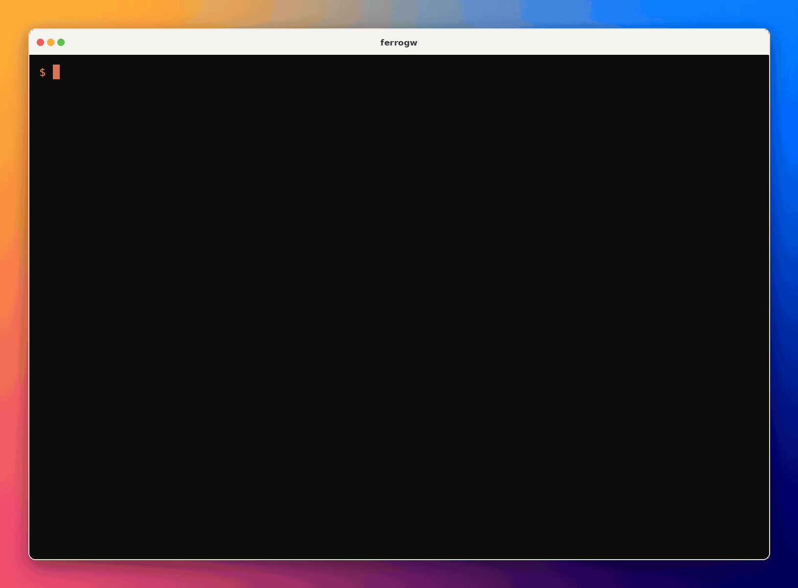
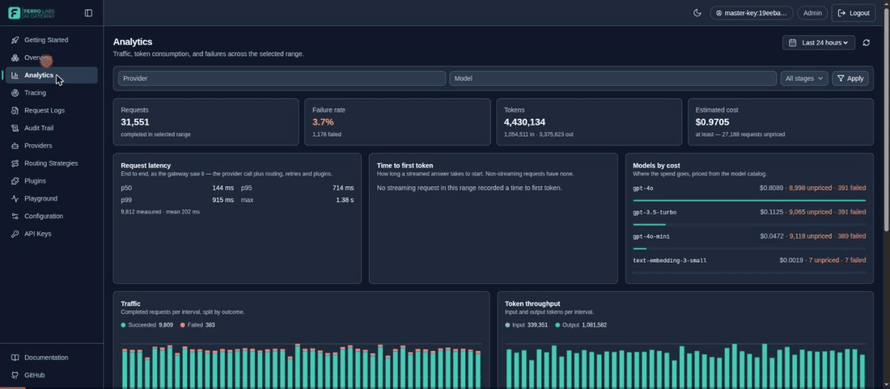
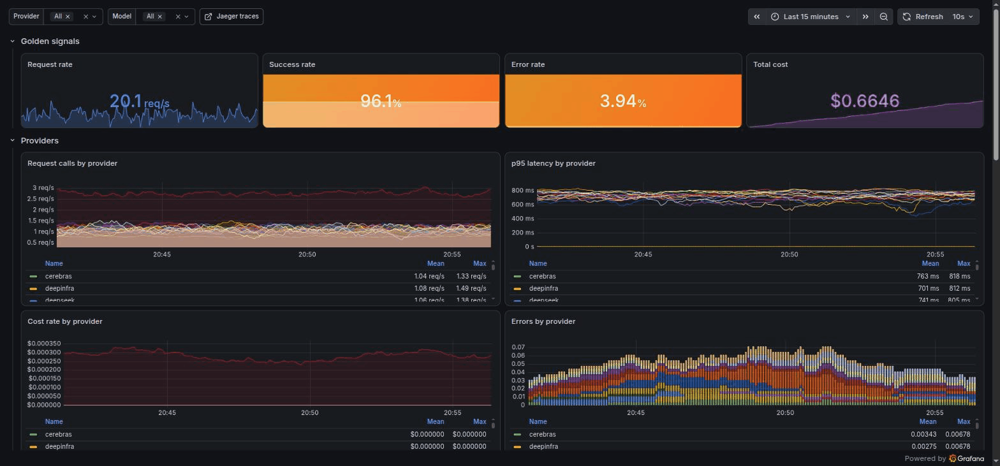
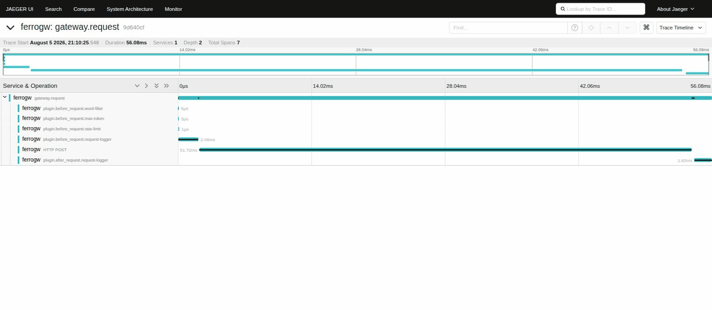
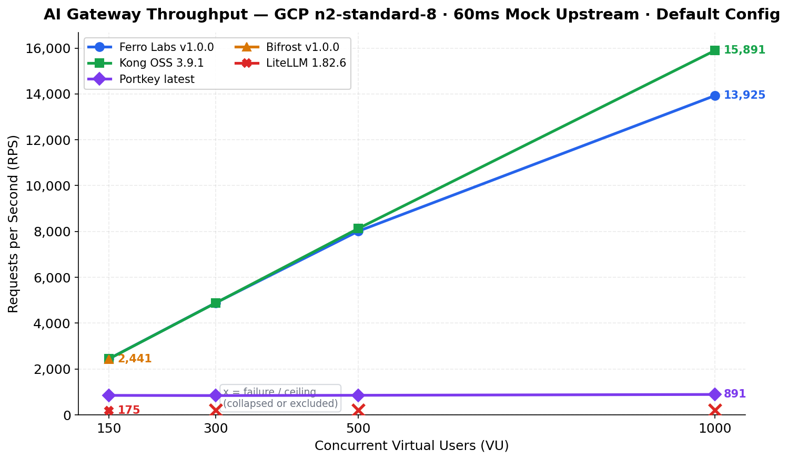

<div align="center">

<p align="right">
  <a href="README.md">English</a> | <a href="README.zh-CN.md">中文</a>
</p>

<table border="0" cellspacing="0" cellpadding="0"><tr>
  <td rowspan="2"></td>
  <td align="center"><h1>Ferro Labs AI 网关</h1></td>
</tr><tr>
  <td align="center"><strong>开源、OpenAI 兼容的 LLM 网关</strong></td>
</tr></table>

**Go 语言编写的高性能 AI 网关。通过单一 OpenAI 兼容 API，将 LLM 请求路由至 30 个提供商。**

[](https://railway.com/deploy/ferro-labs-ai-sqlite-storage?referralCode=KblxKX&utm_medium=integration&utm_source=template&utm_campaign=generic)
[](https://railway.com/deploy/ferro-labs-ai-postgresql-storage?referralCode=KblxKX&utm_medium=integration&utm_source=template&utm_campaign=generic)
[](https://render.com/deploy?repo=https://github.com/ferro-labs/ai-gateway)

[](https://go.dev)
[](https://pkg.go.dev/github.com/ferro-labs/ai-gateway)
[](https://codecov.io/gh/ferro-labs/ai-gateway)
[](LICENSE)
[](https://github.com/ferro-labs/ai-gateway/stargazers)
[](https://github.com/ferro-labs/ai-gateway/actions/workflows/ci.yml)
[](https://github.com/ferro-labs/ai-gateway/actions/workflows/code-scanning.yml)
[](https://deepwiki.com/ferro-labs/ai-gateway)
[](https://artifacthub.io/packages/search?org=ferro-labs)
[](https://docs.ferrolabs.ai)
[](https://discord.gg/yCAeYvJeDV)

📖 **文档：** [docs.ferrolabs.ai](https://docs.ferrolabs.ai)

🔀 **30 个提供商、2,500+ 个模型 —— 统一 API**<br/>
⚡ **1,000 并发用户下 13,925 RPS**（[v1.0.0 基准测试](#性能)）<br/>
📦 **单一静态二进制文件，无需外部服务，32 MB 基础内存**



</div>

---

## 快速开始

从安装到第一个响应，不到两分钟。

| 平台 / 工具 | 安装方式 |
|:---|:---|
| macOS、Linux | `curl -fsSL https://get.ferrolabs.ai \| sh` |
| Windows | `irm https://get.ferrolabs.ai/install.ps1 \| iex` |
| Homebrew | `brew install ferro-labs/tap/ferrogw` |
| Scoop | 先 `scoop bucket add ferrolabs https://github.com/ferro-labs/homebrew-tap` 然后 `scoop install ferrogw` |
| npm | `npm install -g ferrogw` |
| Python | `uv tool install ferrogw` |
| Docker | `docker run -p 8080:8080 ghcr.io/ferro-labs/ai-gateway:latest` |
| Go | `go install github.com/ferro-labs/ai-gateway/cmd/ferrogw@latest` —— 从源码构建，不含控制台 |
| Debian、RPM、Alpine | [发布页面](https://github.com/ferro-labs/ai-gateway/releases/latest) 提供 `.deb`、`.rpm` 与 `.apk` 软件包 |

然后从零跑通第一个请求：

```bash
export OPENAI_API_KEY=sk-your-key     # ferrogw init 会检测到它，并写入对应的目标
ferrogw init                          # 生成 config.yaml，并打印你的主密钥
export GATEWAY_CONFIG=./config.yaml   # 只有设置了它，服务端才会读取配置文件
export MASTER_KEY=fgw_your-master-key # ferrogw init 打印出来的那个密钥
ferrogw serve                         # 在 :8080 启动服务
```

`ferrogw init` 只会打印**一次**主密钥，并且不会把它写入磁盘 —— 请你自己保存，
放进 `.env` 文件或密钥管理服务中。

Docker 会替你运行服务端：保留上面的 export，再用 `-e OPENAI_API_KEY -e MASTER_KEY`
按变量名把它们传给上面的 `docker run` 命令，这样密钥的值不会出现在命令行上
（否则 `ps` 就能看到），并跳过 `ferrogw init`。

<div align="center">
  
</div>

### 第一个请求

```bash
export MASTER_KEY=fgw_your-master-key   # ferrogw init 打印出来的那个密钥；在哪个 shell 里跑 curl，就在哪个 shell 里导出

curl http://localhost:8080/v1/chat/completions \
  -H "Authorization: Bearer $MASTER_KEY" \
  -H "Content-Type: application/json" \
  -d '{
    "model": "gpt-4o-mini",
    "messages": [{"role": "user", "content": "Hello from Ferro Labs AI Gateway"}]
  }' | jq
```

每个版本都使用 keyless cosign 签名，并附带 SPDX SBOM ——
校验步骤见 [SECURITY.md](SECURITY.md#verifying-releases)。

---

## 为什么选择 Ferro Labs AI 网关

大多数 AI 网关要么是高负载下就会崩溃的 Python 代理，要么是内存开销巨大的 JavaScript 服务。Ferro Labs AI 网关从头用 Go 编写，为真实场景的吞吐量而生 —— 单一二进制文件，以可预期的延迟和极低的资源占用路由 LLM 请求。

| 特性             | Ferro Labs  | LiteLLM | Bifrost    | Kong AI     |
|:-----------------|:------------|:--------|:-----------|:------------|
| 语言             | Go          | Python  | Go         | Go/Lua      |
| 单一二进制文件   | ✅          | ❌      | ✅         | ❌          |
| 提供商数量       | 30          | 100+    | 20+        | 10+         |
| MCP 支持         | ✅          | ❌      | ✅         | ❌          |
| 响应缓存         | ✅          | ✅      | ✅         | ❌（付费）  |
| 护栏             | ✅          | ✅      | ❌         | ❌（付费）  |
| 开源许可证       | Apache 2.0  | MIT     | Apache 2.0 | Apache 2.0  |
| 托管云服务       | 即将推出    | ✅      | ✅         | ✅          |

---

## 功能特性

| 能力 | 作用 | 参考 |
|:---|:---|:---|
| 🔀 **路由** | 8 种策略 —— 单一、回退、负载均衡、最低延迟、成本优化、基于内容、A/B 测试、条件路由 —— 并支持按目标配置重试、故障转移与模型别名 | [文档 →](https://docs.ferrolabs.ai/routing/) |
| 🔌 **30 个提供商** | 全部支持对话与流式；在厂商提供的前提下，还支持向量嵌入、图像、重排序、内容审核、语音转文字、文字转语音与批处理 | [文档 →](https://docs.ferrolabs.ai/providers/) |
| 🛡️ **护栏与插件** | 内置六个 —— 敏感词过滤、令牌/消息数限制、响应缓存、限流、按密钥预算、请求日志 —— 插件框架对外开放，可自行编写插件 | [文档 →](https://docs.ferrolabs.ai/plugins/) |
| 🎯 **能力矩阵** | 以声明式记录每个提供商对各项 OpenAI 参数是转发、转换还是无法表达，由 `GET /v1/capabilities` 提供 | [文档 →](https://docs.ferrolabs.ai/guides/provider-capabilities/) |
| 🤖 **MCP** | 连接 stdio 与 Streamable HTTP 工具服务器，把它们的工具注入对话补全，并由网关自身驱动智能体式的 `tool_calls` 循环 | [文档 →](https://docs.ferrolabs.ai/guides/mcp/) |
| 📊 **可观测性** | OpenTelemetry 链路追踪与 Prometheus 指标，日志与 span 共用一个 trace ID —— 未启用时是零分配的空实现 | [文档 →](https://docs.ferrolabs.ai/guides/observability/) |
| 🖥️ **控制台** | 编译进二进制文件并在 `/` 提供的运维控制台 —— 流量、花费、提供商健康状况、请求日志、审计轨迹 | [文档 →](https://docs.ferrolabs.ai/guides/dashboard/) |

---

## 控制台

每个发行版二进制文件都会在 `/` 上提供内置的运维控制台 —— 与 API 同一端口，
通过 `go:embed` 编译进来，无需第二个镜像，也没有第二个源站。使用
`MASTER_KEY` 或任意管理员 / 只读密钥登录，即可读取网关的实时状态：流量、
花费、提供商健康状况、路由、插件、请求日志与审计轨迹。

控制台资源由发布流水线构建，因此用 `go install` 从源码构建的二进制文件是唯一
的例外：它在 `/` 上返回的是占位页面。使用上表中的其他任意安装方式即可获得
控制台。

<div align="center">
  
</div>

总览、分析（延迟 / TTFT / 成本分位数）、提供商、路由、插件、走真实路由路径的
试验场、链路追踪、请求日志、审计轨迹、带历史与回滚的配置，以及带作用域的
API 密钥管理。

运行网关，然后在 <http://localhost:8080> 打开即可。若想看到与上面录屏一样填满
数据的效果，可以启动自包含的演示环境：

```bash
make up-fullstack   # 网关 + Postgres + Jaeger + Prometheus + Grafana + 模拟上游 + 压测生成器
# 然后打开 http://localhost:8080
```

构建与开发细节见 [web/README.md](web/README.md)。

---

## 文档

根目录 README 是总览；每个子系统的参考文档都与其代码放在一起：

| 参考文档 | 涵盖内容 |
|:---|:---|
| [providers/README.md](providers/README.md) | 30 个提供商、各提供商的端点矩阵，以及全部 `/v1/*` 接口 |
| [config/README.md](config/README.md) | 配置加载与校验、`${VAR}` 密钥引用、已声明的模型、受信任代理 |
| [internal/strategies/README.md](internal/strategies/README.md) | 全部 8 种路由策略及其失败语义 |
| [plugin/README.md](plugin/README.md) | 插件框架与六个内置插件 |
| [mcp/README.md](mcp/README.md) | MCP 工具服务器、传输方式、子进程信任边界、就绪判定 |
| [observability/README.md](observability/README.md) | 链路追踪配置、托管后端、上报的属性、隐私级别、导出器 |
| [deploy/README.md](deploy/README.md) | Dockerfile、Compose 文件、全栈演示环境 |
| [web/README.md](web/README.md) | 控制台开发与嵌入契约 |
| [AGENTS.md](AGENTS.md) | 完整的运维 / 开发参考：架构、全部环境变量、请求流程 |
| [SECURITY.md](SECURITY.md) | 漏洞上报、安全态势、发布校验 |
| [CONTRIBUTING.md](CONTRIBUTING.md) | 分支策略、提交规范、提供商 / 插件检查清单 |

---

## 示例

常见场景的集成示例都在 [ferro-labs/ai-gateway-examples](https://github.com/ferro-labs/ai-gateway-examples)：

| 示例 | 说明 |
|:--------|:------------|
| [basic](https://github.com/ferro-labs/ai-gateway-examples/tree/main/basic) | 向第一个已配置的提供商发起单次对话补全 |
| [fallback](https://github.com/ferro-labs/ai-gateway-examples/tree/main/fallback) | 回退策略 —— 按顺序尝试各提供商并重试 |
| [loadbalance](https://github.com/ferro-labs/ai-gateway-examples/tree/main/loadbalance) | 跨目标的加权负载均衡（70/30 分流） |
| [with-guardrails](https://github.com/ferro-labs/ai-gateway-examples/tree/main/with-guardrails) | 内置的敏感词过滤与最大令牌数护栏插件 |
| [with-mcp](https://github.com/ferro-labs/ai-gateway-examples/tree/main/with-mcp) | 本地 MCP 服务器与工具调用集成 |
| [embedded](https://github.com/ferro-labs/ai-gateway-examples/tree/main/embedded) | 把网关作为 HTTP handler 嵌入现有服务 |

---

## 配置

一个由 `GATEWAY_CONFIG` 指定的 YAML/JSON 文件，驱动路由、护栏、MCP
工具与可观测性：

```yaml
strategy:
  mode: fallback              # 8 种模式 —— 见 internal/strategies/README.md

targets:
  - virtual_key: openai       # 这是一份白名单：只有列出的提供商才可路由
    retry: { attempts: 3 }    # 按目标配置，在每种路由模式下都生效
    concurrency: { max_concurrency: 32, queue_size: 1000 }
  - virtual_key: anthropic

aliases:
  fast: gpt-4o-mini

plugins:                      # 护栏在前，缓存在后 —— 见 plugin/README.md
  - name: word-filter
    type: guardrail
    stage: before_request
    enabled: true
    config: { blocked_words: ["password", "secret"] }

mcp_servers:                  # 工具服务器 —— 见 mcp/README.md
  - name: search
    url: https://mcp.example.com/mcp
    headers: { Authorization: "Bearer ${SEARCH_TOKEN}" }
```

`${VAR}` 引用（仅支持带花括号的写法）在组件构造时解析，而非配置加载时 ——
因此密钥永远不会被存储、不会被 `GET /admin/config` 返回，也不会被回滚恢复。
单独的 `$` 视为普通数据；引用未定义的变量则是错误。

包含全部选项的完整带注释参考是
[config.example.yaml](config.example.yaml) /
[config.example.json](config.example.json)，schema 指南见
[config/README.md](config/README.md)。`ferrogw validate` 可在不启动服务的
情况下校验配置文件。

### 关键环境变量

| 变量 | 用途 |
|----------|---------|
| `MASTER_KEY` | 引导与应急管理员凭据（由 `ferrogw init` 生成）；日常使用请通过 `POST /admin/keys` 为每位运维人员单独签发密钥 |
| `GATEWAY_CONFIG` | 配置 YAML/JSON 的路径 |
| `GATEWAY_ENV` | 设为 `production` 可启用生产模式安全防护：当 `ALLOW_UNAUTHENTICATED_PROXY=true` 或 `CORS_ORIGINS` 中出现 `*` 条目时拒绝启动；当按 IP 限流关闭、挂载了 pprof 或 API 密钥存储为内存实现时发出告警 |
| `PORT` | 服务端口（默认：`8080`） |
| `ALLOW_UNAUTHENTICATED_PROXY` | 设为 `true` 可关闭代理路由的鉴权（仅限开发；`GATEWAY_ENV=production` 下被禁止） |
| `CORS_ORIGINS` | 逗号分隔的 CORS 允许来源；未设置时拒绝所有跨域请求。采用**字面**匹配 —— 不支持通配符，因此请逐个列出来源 |
| `TRUSTED_PROXIES` | 受信任反向代理的 CIDR；只有来自这些网段的转发头才会被采信（默认：回环地址）。见 [config/README.md](config/README.md#trusted-proxies-trusted_proxies) |
| `<PROVIDER>_BASE_URL` | 把某个提供商指向代理、自托管服务或区域端点。它是 **API 根地址**，会被原样使用 —— 请完全按厂商文档书写，包含版本段 (`https://api.groq.com/openai/v1`)；仅含主机名的值会解析到该提供商自身的版本段 |

完整的环境变量参考（包括提供商 API 密钥、存储后端与 OTel 设置）见 [AGENTS.md](AGENTS.md)。

---

## 可观测性

**看清网关做的每一件事** —— 每个请求、花了多少钱、耗时多久、由哪个提供商服务、执行了哪些护栏。Ferro Labs AI 网关开箱即用地提供一流的 **OpenTelemetry 链路追踪**与 **Prometheus 指标**，并且在你启用之前始终是**零分配的空实现**。把它指向 **Jaeger、Grafana、New Relic、LangSmith、Datadog 或 Honeycomb** —— 任何支持 OTLP 的后端 —— 每个请求都会产生一个 `gateway.request` span，携带 GenAI 语义约定（`gen_ai.*`）以及用于成本、路由、MCP 工具调用与流式时序的 `ferro.*` 扩展属性。同一个 trace ID 会贯穿你的日志、span 与 `X-Request-ID` 响应头。

> 📈 **完整可观测性指南 → [observability/README.md](observability/README.md)** —— 托管后端配置、端点与传输规则、上报的全部属性、隐私级别以及导出器插件。

一条命令即可启动网关，并接上由生成流量驱动的完整监控栈 —— **Prometheus、Grafana 与 Jaeger**：

```bash
make up-fullstack   # 然后在 http://localhost:3000 打开 Grafana
```

<p align="center">
  
  <br/>
  <em>Grafana —— 请求速率、延迟分位数、按提供商拆分、令牌成本与熔断器状态，全部来自网关的 Prometheus 指标。</em>
</p>

<p align="center">
  
  <br/>
  <em>Jaeger —— 一次请求的 <code>gateway.request</code> span，展开后可见其 <code>gen_ai.*</code> 与 <code>ferro.*</code> 属性。</em>
</p>

一个变量即可启用链路追踪（也可用 `observability:` 配置块 —— 端点、协议、
采样、隐私级别与请求头都在指南中有说明）：

```bash
export OTEL_EXPORTER_OTLP_ENDPOINT=localhost:4317
ferrogw serve
```

---

## CLI

`ferrogw` 是单一二进制文件 —— 无需额外的 CLI 工具。

| 命令 | 说明 |
|:--------|:------------|
| `ferrogw` | 启动网关服务（默认） |
| `ferrogw serve` | 启动网关服务（显式） |
| `ferrogw init` | 首次运行初始化 —— 生成主密钥与配置 |
| `ferrogw validate` | 不启动服务，仅校验配置文件 |
| `ferrogw doctor` | 检查运行环境（API 密钥、配置、连通性） |
| `ferrogw status` | 查看网关健康状况与提供商状态 |
| `ferrogw version` | 打印版本、提交与构建信息 |
| `ferrogw admin keys list` | 列出 API 密钥 |
| `ferrogw admin keys create --name <name>` | 创建 API 密钥（`--scope`、`--expires-in`） |
| `ferrogw admin logs stats` | 查看请求日志统计 |
| `ferrogw plugins` | 列出已注册的插件 |

所有子命令通用的全局参数：`--gateway-url`、`--api-key`、`--format`（table/json/yaml）。

---

## 部署

### 本地开发

```bash
export OPENAI_API_KEY=sk-your-key
export MASTER_KEY=fgw_your-master-key
export GATEWAY_CONFIG=./config.yaml
make build && ./bin/ferrogw
```

### Railway 与 Render

本 README 顶部的部署按钮可在这两个平台上完成开通：Railway 可选择挂载卷上的
SQLite（把三个 `*_STORE_DSN` 变量设为 `/data` 下的路径）或 PostgreSQL；
Render 则使用仓库中的 `render.yaml` Blueprint，它会自动生成 `MASTER_KEY`
并把各存储 DSN 接到托管 Postgres 上。

### Docker Compose

`deploy/` 下的三个 Compose 文件遵循标准的 override 模式 —— 一个共享的基础
文件、一个从源码构建的开发 override，以及一个带固定标签、健康检查和资源限制
的生产 override。全部命令都在仓库根目录执行：

```bash
make up             # 开发环境：从源码构建
IMAGE_TAG=v1.4.0 CORS_ORIGINS=https://your-domain.com make up-prod
make down           # 两种模式通用的停止命令
```

一个容器同时提供 API 与控制台 —— 无需第二个镜像，也没有第二个源站。提供商
密钥放在仓库根目录的 `.env` 或环境变量中。
[deploy/README.md](deploy/README.md) 提供完整参考，包括自包含的 PostgreSQL
组合以及全栈可观测性环境。

### 通过 Helm 部署到 Kubernetes

```bash
helm repo add ferro-labs https://ferro-labs.github.io/helm-charts
helm repo update
helm install ferro-gw ferro-labs/ai-gateway \
  --set env.OPENAI_API_KEY=sk-your-key
```

Helm charts：[github.com/ferro-labs/helm-charts](https://github.com/ferro-labs/helm-charts) | [ArtifactHub](https://artifacthub.io/packages/search?org=ferro-labs)

---

## 迁移至 Ferro Labs AI 网关

网关兼容 OpenAI，因此无论从哪个网关迁移 —— 或是从直接调用提供商迁移 ——
都只是改一个 `base_url`。

### 从 LiteLLM 迁移

**迁移前（LiteLLM）：**

```python
from litellm import completion

response = completion(
    model="gpt-4o",
    messages=[{"role": "user", "content": "Hello"}]
)
```

**迁移后（Ferro Labs AI 网关）：**

```python
from openai import OpenAI

client = OpenAI(
    base_url="http://localhost:8080/v1",
    api_key="your-ferro-api-key",
)

response = client.chat.completions.create(
    model="gpt-4o",
    messages=[{"role": "user", "content": "Hello"}],
)
```

提供商 API 密钥改用环境变量（`OPENAI_API_KEY`、
`ANTHROPIC_API_KEY` 等）；模型列表则变成 `config.yaml` 中的
`targets` 与 `aliases`。

**为什么从 LiteLLM 迁移：**

- 150 并发用户下吞吐量达 14 倍（2,447 对 175 RPS）
- 峰值负载下内存占用仅为其 1/23（流式场景 47 MB 对 1,124 MB）
- 单一二进制文件 —— 无需 Python 环境、无需 pip、无需 virtualenv
- 延迟可预期 —— 150 VU 下 p99 保持在 65ms 以内，而 LiteLLM 在同等并发下已经超时

### 从 Portkey 迁移

代码改动同样只有那一行 —— 自托管模式下，Ferro Labs 使用标准 OpenAI SDK，
无需任何自定义请求头。

**为什么从 Portkey 迁移：**

- 完全开源 —— 没有按请求计费，也没有日志限制
- 自托管 —— 网关运行在你自己的基础设施中，提示词只会发往你所配置的提供商
- 不锁定厂商 —— Apache 2.0 许可证
- 支持 MCP —— Portkey 自托管版缺少原生 MCP
- 需要托管服务的团队还可以选择 FerroCloud（即将推出）

---

## 性能

本节的每一个数字都来自同一次测试：**Ferro Labs v1.0.0，测量于
2026-03-23**。在 **GCP n2-standard-8**（8 vCPU、32 GB 内存）上，使用
**固定 60ms 延迟的模拟上游**，与 Kong OSS、Bifrost、LiteLLM 和 Portkey
对比测试 —— 结果只反映网关自身的开销。后续版本尚未重新测量；请用下面的
命令针对你准备运行的版本自行复现。



| VU | RPS | p50 | p99 | 内存 |
|---:|---:|---:|---:|---:|
| 50 | 813 | 61.3ms | 64.1ms | 36 MB |
| 150 | 2,447 | 61.2ms | 63.4ms | 47 MB |
| 300 | 4,890 | 61.2ms | 64.4ms | 72 MB |
| 500 | 8,014 | 61.5ms | 72.9ms | 89 MB |
| 1,000 | 13,925 | 68.1ms | 111.9ms | 135 MB |

1,000 VU 时：**13,925 RPS**，p50 开销 **8.1ms**，内存 **135 MB**。
面向线上 OpenAI API 时，在典型插件配置下网关自身仅增加 **25 微秒** 的
p50 延迟，未启用任何插件时为 **2 微秒**。

完整方法论、原始结果与火焰图分析：
[ferro-labs/ai-gateway-performance-benchmarks](https://github.com/ferro-labs/ai-gateway-performance-benchmarks)
（`make setup && make bench` 可复现）。

---

## FerroCloud

FerroCloud —— Ferro Labs AI 网关的托管版本，具备多租户、分析与成本治理能力 —— 即将推出。

👉 **前往 [ferrolabs.ai](https://ferrolabs.ai) 加入等待名单**

---

## SDK

Ferro Labs AI 网关的官方客户端库 —— 标准 OpenAI SDK 也可直接使用：
把 `base_url` 指向 `http://your-gateway:8080/v1` 即可。

| SDK | 安装 | 仓库 |
|:----|:--------|:-----------|
| Python | `pip install ferrolabs` | [ferro-labs/ferrolabs-python-sdk](https://github.com/ferro-labs/ferrolabs-python-sdk) |
| TypeScript | `npm install ferrolabs` | [ferro-labs/ferrolabs-typescript-sdk](https://github.com/ferro-labs/ferrolabs-typescript-sdk) |

<details>
<summary><strong>Python</strong></summary>

```python
from ferrolabs import FerroClient

client = FerroClient(
    base_url="http://localhost:8080/v1",
    api_key="your-ferro-api-key",
)

response = client.chat.completions.create(
    model="gpt-4o",
    messages=[{"role": "user", "content": "Hello"}],
)
```

</details>

<details>
<summary><strong>TypeScript</strong></summary>

```typescript
import { FerroClient } from "ferrolabs";

const client = new FerroClient({
  baseURL: "http://localhost:8080/v1",
  apiKey: "your-ferro-api-key",
});

const response = await client.chat.completions.create({
  model: "gpt-4o",
  messages: [{ role: "user", content: "Hello" }],
});
```

</details>

---

## 贡献

我们欢迎贡献。新增提供商只能提交到这个开源仓库，绝不进入 FerroCloud。分支策略、提交规范与 PR 指南见 [CONTRIBUTING.md](CONTRIBUTING.md)。

---

## 社区

- [GitHub Discussions](https://github.com/ferro-labs/ai-gateway/discussions)
- [Discord](https://discord.gg/yCAeYvJeDV)
- 用 Ferro Labs AI 网关做了东西？欢迎提 PR 加入我们的展示墙。

---

## 许可证

Apache 2.0 —— 见 [LICENSE](LICENSE)。
